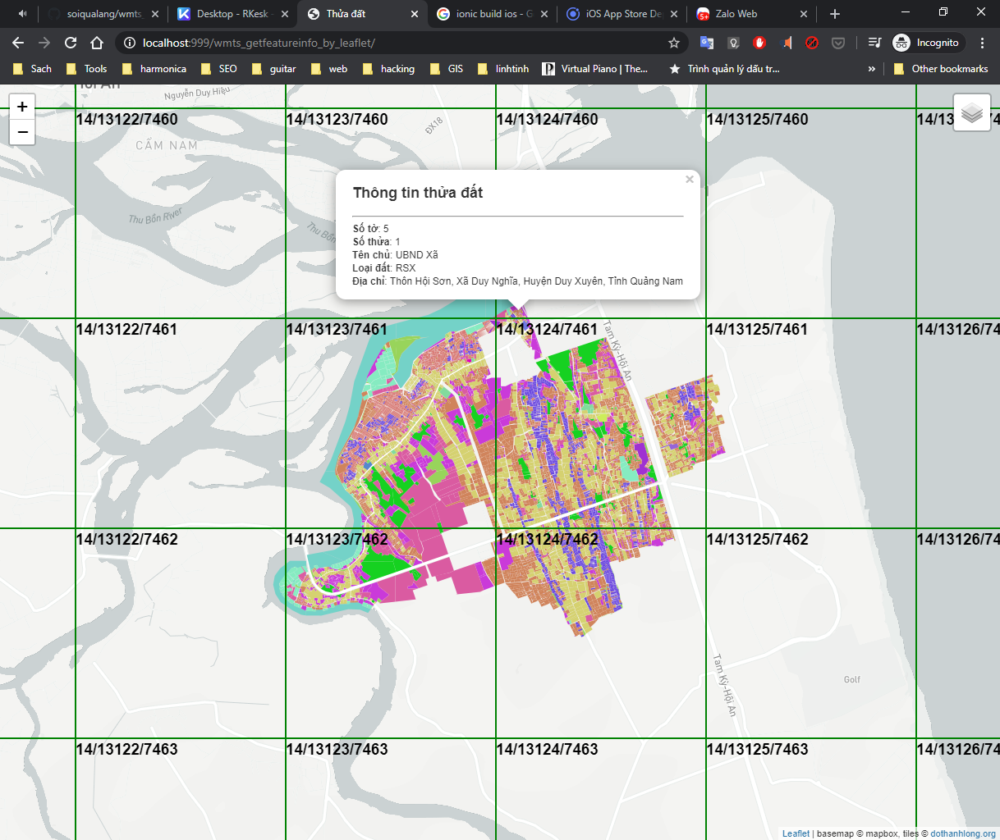

# wmts_getfeatureinfo_by_leaflet
WMTS GetFeatureInfo by Leaflet



### Add WMTS


//4326

https://geo.dothanhlong.org/geoserver/gwc/service/wmts?layer=thuadat:view_duynghia_4326&style=&tilematrixset=EPSG:4326&Service=WMTS&Request=GetTile&Version=1.0.0&Format=image/png&TileMatrix=EPSG:4326:14&TileCol=26247&TileRow=6749

https://geo.dothanhlong.org/geoserver/gwc/demo/thuadat:view_duynghia_4326?gridSet=EPSG:4326&format=image/png

//900913

https://geo.dothanhlong.org/geoserver/gwc/service/wmts?layer=thuadat:view_duynghia_4326&style=&tilematrixset=EPSG:900913&Service=WMTS&Request=GetTile&Version=1.0.0&Format=image/png&TileMatrix=EPSG:900913:15&TileCol=26248&TileRow=14923

https://geo.dothanhlong.org/geoserver/gwc/demo/thuadat:view_duynghia_4326?gridSet=EPSG:900913&format=image/png


> Chồng lớp, phải dùng `srid:900913`

### WMTS GetFeatureInfo

https://geo.dothanhlong.org/geoserver/gwc/service/wmts?VERSION=1.0.0&LAYER=thuadat:view_duynghia_4326&STYLE=&TILEMATRIX=EPSG:900913:14&TILEMATRIXSET=EPSG:900913&SERVICE=WMTS&FORMAT=image/png&SERVICE=WMTS&REQUEST=GetFeatureInfo&INFOFORMAT=application/json&TileCol=13123&TileRow=7462&I=210&J=57

https://geo.dothanhlong.org/geoserver/gwc/service/wmts?VERSION=1.0.0&LAYER=thuadat:view_duynghia_4326&STYLE=&TILEMATRIX=EPSG:900913:14&TILEMATRIXSET=EPSG:900913&SERVICE=WMTS&FORMAT=image/png&SERVICE=WMTS&REQUEST=GetFeatureInfo&INFOFORMAT=text/html&TileCol=13123&TileRow=7462&I=212&J=72

```txt
# WMTS
https://geo.dothanhlong.org/geoserver/gwc/service/wmts?VERSION=1.0.0&
LAYER=thuadat:view_duynghia_4326&
STYLE=&
TILEMATRIX=EPSG:900913:14&
TILEMATRIXSET=EPSG:900913&
SERVICE=WMTS&
FORMAT=image/png&
SERVICE=WMTS&
REQUEST=GetFeatureInfo&
INFOFORMAT=application/json&
TileCol=13123&
TileRow=7462&
I=212&
J=72

#WMS
https://geo.dothanhlong.org/geoserver/thuadat/wms?&
REQUEST=GetFeatureInfo&
SERVICE=WMS&
SRS=EPSG:4326&
STYLES=&
TRANSPARENT=true&
VERSION=1.1.1&
FORMAT=image/png&
BBOX=108.35506439208986,15.805219940979784,108.40046882629396,15.877221845871363&
HEIGHT=872&
WIDTH=529&
LAYERS=thuadat:view_duynghia_4326&
QUERY_LAYERS=thuadat:view_duynghia_4326&
INFO_FORMAT=application/json&
X=121&
Y=586
```

> Đối với WMTS chưa tính được 2 tham số I,J

=> Quay về viết hàm GetFeatureInfo() của WMS. Bản đồ thì vẫn load WMTS để tăng đốc độ tải bản đồ.

## Preferences

https://gis.stackexchange.com/questions/177823/using-leaflet-and-web-map-tile-service-wmts

https://gis.stackexchange.com/questions/149062/display-tile-grid-borders-with-leaflet-visual-debugging

https://gis.stackexchange.com/questions/300606/calculate-row-and-column-for-wmts-request-from-lat-long

http://www.atlefren.net/post/2014/05/how-to-calculate-maxresolution-for-wmts-given-info-in-getcapabilities/


----

## Linh tinh

```js
var tileSize = tilegrid.getTileSize(zoomIdx);
var tileOrigin = tilegrid.getOrigin(zoomIdx);

var fx = (evt.coordinate[0] - tileOrigin[0]) / (resolution * tileSize[0]);
var fy = (tileOrigin[1] - evt.coordinate[1]) / (resolution * tileSize[1]);
var tileCol = Math.floor(fx);
var tileRow = Math.floor(fy);
var tileI = Math.floor((fx - tileCol) * tileSize[0]);
var tileJ = Math.floor((fy - tileRow) * tileSize[1]);


tiles_per_degree_longitude = MX / 360
tiles_per_degree_latitude = MY / 180
dX = X + 180
dY = 90 - Y
tileX = dX * tiles_per_degree_longitude
tileY = dY * tiles_per_degree_latitude


MX=256;
MY=256;
X=529;
Y=872;

tiles_per_degree_longitude = MX / 360
tiles_per_degree_latitude = MY / 180
dX = X + 180
dY = 90 - Y
tileX = dX * tiles_per_degree_longitude
tileY = dY * tiles_per_degree_latitude

################

Openlayers

map.on('singleclick', function(evt) {
  document.getElementById('info').innerHTML = '';

  var source = layer.getSource();
  var resolution = view.getResolution();
  var tilegrid = source.getTileGrid();
  var tileResolutions = tilegrid.getResolutions();
  var zoomIdx, diff = Infinity;

  for (var i = 0; i < tileResolutions.length; i++) {
      var tileResolution = tileResolutions[i];
      var diffP = Math.abs(resolution-tileResolution);
      if (diffP < diff) {
          diff = diffP;
          zoomIdx = i;
      }
      if (tileResolution < resolution) {
        break;
      }
  }
  var tileSize = tilegrid.getTileSize(zoomIdx);
  var tileOrigin = tilegrid.getOrigin(zoomIdx);

  var fx = (evt.coordinate[0] - tileOrigin[0]) / (resolution * tileSize[0]);
  var fy = (tileOrigin[1] - evt.coordinate[1]) / (resolution * tileSize[1]);
  var tileCol = Math.floor(fx);
  var tileRow = Math.floor(fy);
  var tileI = Math.floor((fx - tileCol) * tileSize[0]);
  var tileJ = Math.floor((fy - tileRow) * tileSize[1]);
  var matrixIds = tilegrid.getMatrixIds()[zoomIdx];
  var matrixSet = source.getMatrixSet();

  var url = baseUrl+'?'
  for (var param in params) {
    if (param.toUpperCase() == 'TILEMATRIX') {
      url = url + 'TILEMATRIX='+matrixIds+'&';
    } else {
      url = url + param + '=' + params[param] + '&';
    }
  }

  url = url
    + 'SERVICE=WMTS&REQUEST=GetFeatureInfo'
    + '&INFOFORMAT=' +  infoFormat
    + '&TileCol=' +  tileCol
    + '&TileRow=' +  tileRow
    + '&I=' +  tileI
    + '&J=' +  tileJ;

  if (url) {
    document.getElementById('info').innerHTML = 'Loading... please wait...';
    var xmlhttp = new XMLHttpRequest();    xmlhttp.onreadystatechange = function() {
        if (xmlhttp.readyState == XMLHttpRequest.DONE ) {
           if (xmlhttp.status == 200) {
               document.getElementById('info').innerHTML = xmlhttp.responseText;
           }
           else {
              document.getElementById('info').innerHTML = '';
           }
        }
    }
  xmlhttp.open('GET', url, true);
  xmlhttp.send();
  }
});
}

```